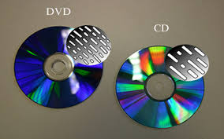

# 1. Definicion

Los CDs (Compact Discs) y DVDs (Digital Versatile Discs) son dispositivos de almacenamiento óptico que se popularizaron a partir de los años 80 y 90. Funcionan mediante un láser que graba y lee la información en una superficie reflectante. Aunque hoy en día han sido en gran parte reemplazados por memorias USB y almacenamiento en la nube, siguen utilizándose en muchos sectores, como la distribución de música, películas y software. Su capacidad de almacenamiento y durabilidad los hicieron una opción confiable durante décadas.

