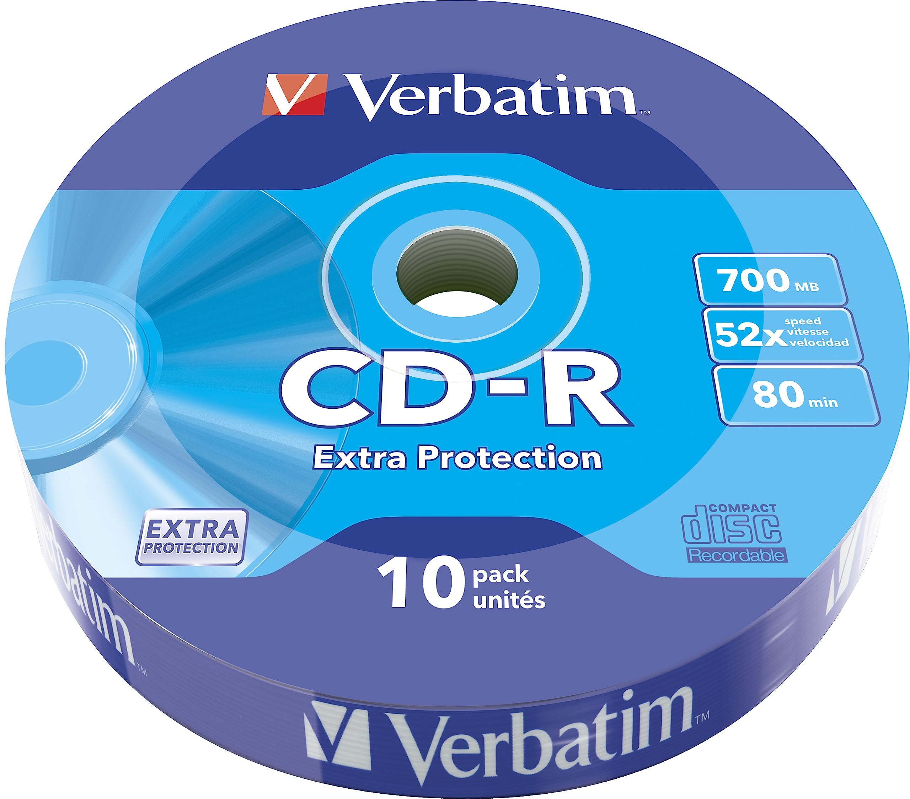
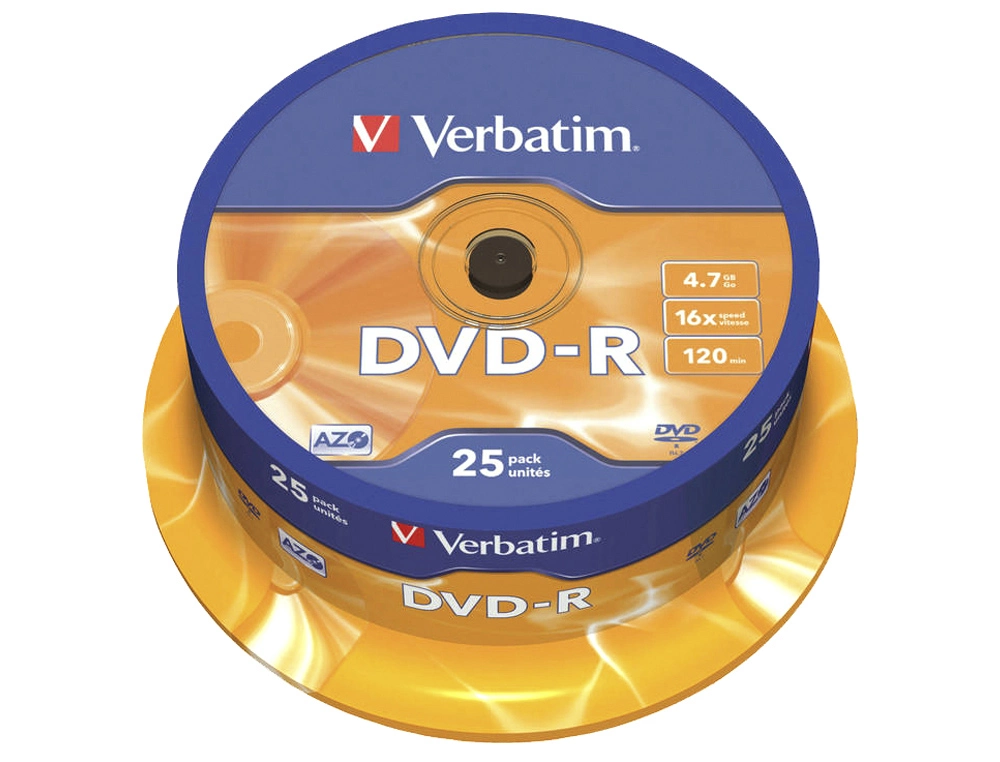
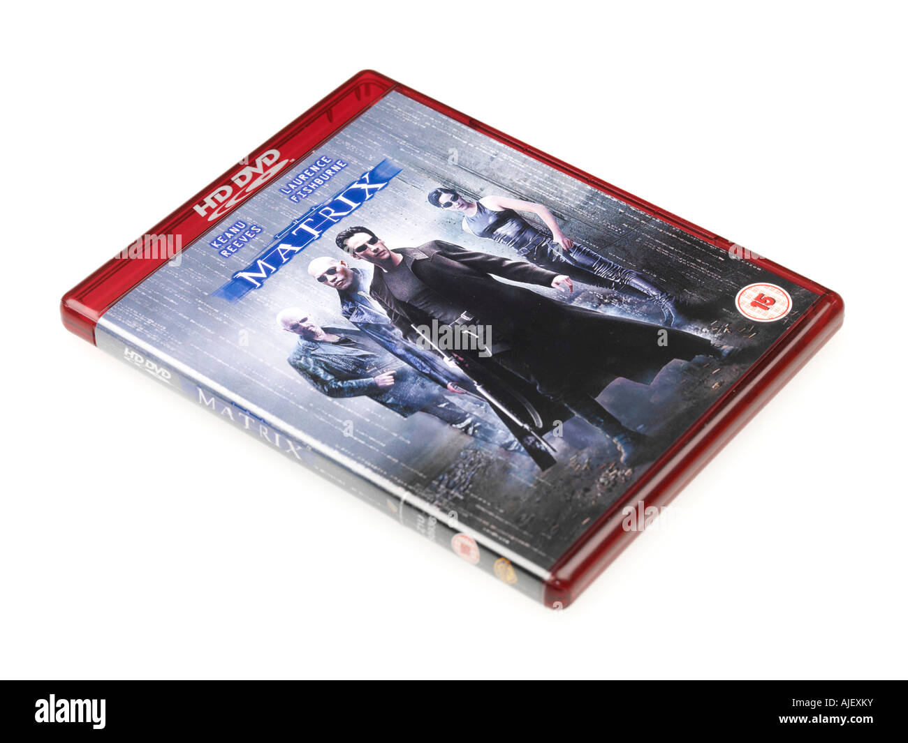

# 3. Tipos

Los discos ópticos han evolucionado para adaptarse a diferentes necesidades. Estos son los más comunes:

## CDs

**CD-ROM**: Solo permite lectura, se usa para software y videojuegos.

**CD-R**: Se puede grabar una vez y luego solo leer.

**CD-RW**: Permite grabar y borrar datos varias veces.

## DVDs

**DVD-ROM**: Solo lectura, similar a los CD-ROM.

**DVD-R y DVD+R**: Se pueden grabar una vez.

**DVD-RW y DVD+RW**: Regrabables, ideales para backups y almacenamiento temporal.

**DVD-RAM**: Menos común, pero diseñado para un uso intensivo de grabado y borrado.

## Mencion honorífica

**HD DVD**  

**CD Audio**  

